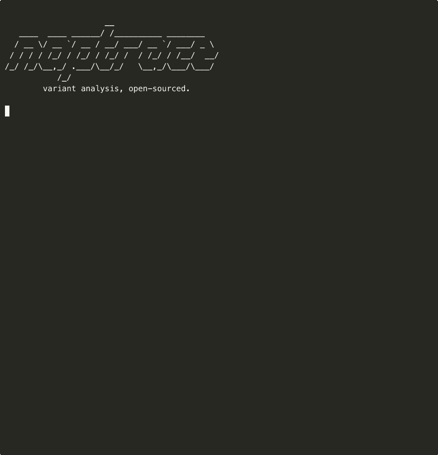

<p align="center">
<pre>
                      __
   ____  ____ _____  / /__________ _________
  / __ \/ __ `/ __ \/ __/ ___/ __ `/ ___/ _ \
 / / / / /_/ / /_/ / /_/ /  / /_/ / /__/  __/
/_/ /_/\__,_/ .___/\__/_/   \__,_/\___/\___/
           /_/
  -->--+-->  the twin hunter for CVEs
</pre>
</p>

<p align="center">
  <a href="#install">Install</a> &bull;
  <a href="#usage">Usage</a> &bull;
  <a href="#how-it-works">How it works</a> &bull;
  <a href="#why-this-exists">Why</a> &bull;
  <a href="LICENSE">Apache-2.0</a>
</p>

<p align="center">
  
</p>

Feed naptrace a CVE patch. It finds every structural twin of that bug across your codebase.

```
$ naptrace hunt file:cve_2025_6965.patch ./target-project

  [1/6] ingesting patch...              done (0.0s)
  [2/6] distilling signature...         INTEGER_OVERFLOW (10/10)
  [3/6] retrieving candidates (K=5)...  5 candidates
  [4/6] slicing CPG paths...            5 sliced
  [5/6] reasoning over candidates...    3 findings
  [6/6] report

  >> FEASIBLE   src/math.c:4-7    [unsafe_add]
     Unchecked integer addition — same pattern as CVE-2025-6965.
     confidence: 8/10    similarity: 62%

  >> FEASIBLE   src/math.c:19-22  [unsafe_multiply]
     Unchecked integer multiplication without overflow guard.
     confidence: 7/10    similarity: 60%

  ?? NEEDS_CHECK src/math.c:10-16 [safe_add]
     Has overflow check but path feasibility uncertain.
     confidence: 4/10    similarity: 64%

  summary: 2 feasible, 1 needs_check, 2 infeasible
```

## Install

```sh
# From crates.io (recommended)
cargo install naptrace
```
```sh
# From source
cargo install --git https://github.com/hamzamiladin/naptrace
```

Requires Rust 1.85+. Install Rust: `curl --proto '=https' --tlsv1.2 -sSf https://sh.rustup.rs | sh`

## What it finds

Given the patch for CVE-2025-6965 (the SQLite integer overflow Google's Big Sleep found in July 2025):

```diff
--- a/src/vdbe.c
+++ b/src/vdbe.c
@@ -3837,7 +3837,9 @@ case OP_Add: {
-    iA = pIn1->u.i;
-    iB = pIn2->u.i;
-    iResult = iA + iB;
+    iA = pIn1->u.i;
+    iB = pIn2->u.i;
+    if( sqlite3AddInt64(&iResult, iA, iB) ){
+      goto fp_math;
+    }
```

Naptrace finds every function in your codebase with the same unchecked-arithmetic pattern, builds a code property graph, and uses an LLM to determine which candidates are actually reachable and exploitable.

## How it works

```
  naptrace hunt <patch> <target>
         |
  +------+------+
  |  1. Ingest  |  Parse patch from CVE ID, git commit, diff file, or PR URL
  +------+------+
  +------+------+
  | 2. Distill  |  LLM extracts structural vulnerability signature
  +------+------+
  +------+------+
  | 3. Retrieve |  tree-sitter + embeddings find top-K similar functions
  +------+------+
  +------+------+
  |  4. Slice   |  Joern CPG paths for each candidate (auto-installs)
  +------+------+
  +------+------+
  |  5. Reason  |  LLM verdict: feasible / infeasible / needs_check
  +------+------+
  +------+------+
  |  6. Report  |  SARIF 2.1.0 + terminal output
  +------+------+
```

## Usage

```sh
# Hunt from a CVE ID (fetches patch from NVD)
naptrace hunt cve:CVE-2025-6965 ./my-project

# Hunt from a git commit
naptrace hunt https://github.com/sqlite/sqlite@abc123f ./target

# Hunt from a local diff file
naptrace hunt file:patch.diff ./target

# Hunt from a pull request
naptrace hunt pr:https://github.com/user/repo/pull/42 .

# Fully offline with Ollama (zero API keys)
naptrace hunt --reasoner ollama cve:CVE-2025-6965 .

# SARIF output for CI
naptrace hunt cve:CVE-2025-6965 . --output sarif > findings.sarif

# Replay a finding with full trace
naptrace explain <finding-id>

# Check your setup
naptrace doctor
```

## GitHub Action

```sh
naptrace init-action
```

Or add manually:

```yaml
- uses: hamzamiladin/naptrace-action@v1
  with:
    patch: cve:CVE-2025-6965
    target: .
    reasoner: anthropic
    api-key: ${{ secrets.ANTHROPIC_API_KEY }}
```

## LLM Backends

| Provider | Flag | Model | Requires |
|----------|------|-------|----------|
| Ollama (local) | `--reasoner ollama` | qwen2.5-coder:32b | Nothing (auto-downloads) |
| Groq (free) | `--reasoner groq` | llama-3.3-70b-versatile | `GROQ_API_KEY` (free tier) |
| Anthropic | `--reasoner anthropic` | claude-opus-4-7 | `ANTHROPIC_API_KEY` |
| OpenAI | `--reasoner openai` | gpt-4o | `OPENAI_API_KEY` |

All providers have built-in rate limit retry with exponential backoff.

### Setup

```sh
# Groq (recommended — free, fast, 70B model)
export GROQ_API_KEY=gsk_...        # Get free key at console.groq.com

# Ollama (fully local, no account needed)
# Just install ollama — models download automatically on first run

# Anthropic
export ANTHROPIC_API_KEY=sk-ant-...  # console.anthropic.com

# OpenAI
export OPENAI_API_KEY=sk-...         # platform.openai.com
```

Run `naptrace doctor` to verify which providers are configured.

## Tested Against

| Codebase | Language | Functions | Candidates | After Rerank | CPG Paths | Result |
|----------|----------|-----------|------------|-------------|-----------|--------|
| Redis | C | 5,335 | 10 | 2 | 1 | 0 FP — sanitizers correctly filtered by reranker |
| Django GIS | Python | ~200 | 5 | 1 | N/A | 0 FP — correctly rejected |
| Flask | Python | ~200 | 5 | 0 | N/A | 0 FP — reranker filtered all (no pickle usage) |
| Gson | Java | ~300 | 5 | 0 | N/A | 0 FP — reranker filtered all (safe JSON deser) |
| Expat (pre-patch) | C | 326 | 10 | 9 | 6 | **Found missed variant** of CVE-2022-22822 in `getContext()` |
| Custom C | C | 5 | 5 | 2 | 2 | Correct — sanitizer filtered, CPG paths found |

## Benchmarks

28 CVEs across 17 vulnerability families, 7 languages:

| Family | CVEs | Language | Bug class | Year |
|--------|------|----------|-----------|------|
| Linux io_uring pbuf | 3 CVEs | C | UAF / race | 2024-25 |
| SQLite arithmetic | CVE-2025-6965 (Big Sleep) | C | integer overflow | 2025 |
| OpenSSL ASN.1 | 4 CVEs (AISLE) | C | buffer overflow | 2025-26 |
| curl boundary | CVE-2025-9086 | C | OOB read | 2025 |
| libxml2 buffer calc | CVE-2025-6021 | C | integer overflow | 2025 |
| Python pickle RCE | 2 CVEs (vLLM, socketio) | Python | deserialization | 2025 |
| Apache Commons | CVE-2025-48734 | Java | access control | 2025 |
| WebKit Big Sleep | 2 CVEs | C++ | UAF / overflow | 2025 |
| Django ORM SQLi | CVE-2026-1207, -1287 | Python | injection | **2026** |
| Linux Netfilter | 3 CVEs | C | NULL deref / OOB | **2026** |
| AppArmor CrackArmor | CVE-2026-23268 (9-CVE family) | C | priv escalation | **2026** |
| Linux ksmbd | CVE-2026-23226 | C | UAF | **2026** |
| Composer injection | CVE-2026-40176, -40261 | PHP | command injection | **2026** |
| Node.js HTTP | CVE-2026-21637 | C++ | header injection | **2026** |
| Spring path traversal | CVE-2026-22737 | Java | path traversal | **2026** |
| Chrome Dawn WebGPU | CVE-2026-5281, -4676 (zero-day) | C++ | UAF | **2026** |

Full corpus: [`benchmarks/ground_truth.yaml`](benchmarks/ground_truth.yaml) | Harness: [`benchmarks/run.sh`](benchmarks/run.sh)

### Custom benchmarks

Add your own CVEs to test against:

```sh
# Run with your own corpus file
naptrace bench --corpus ~/my-cves.yaml
```

Format (see [`benchmarks/README.md`](benchmarks/README.md) for full schema):

```yaml
- cve: CVE-2025-XXXXX
  description: "Your vulnerability description"
  bug_class: INTEGER_OVERFLOW
  source_repo: https://github.com/org/repo
  patch_commit: abc123
  language: c
  variants:
    - file: src/vulnerable.c
      function: do_math
      is_feasible: true
      notes: "No overflow check before addition"
```

## Why this exists

Google's Big Sleep (Project Zero + DeepMind) proved that LLMs can perform **variant analysis** -- given a patched bug, find its structural twins across a codebase. Big Sleep found real CVEs in SQLite, Chrome, and WebKit that fuzzing missed.

The agent, prompts, and harness are all closed-source.

Naptrace is the open-source version.

## License

[Apache-2.0](LICENSE)
